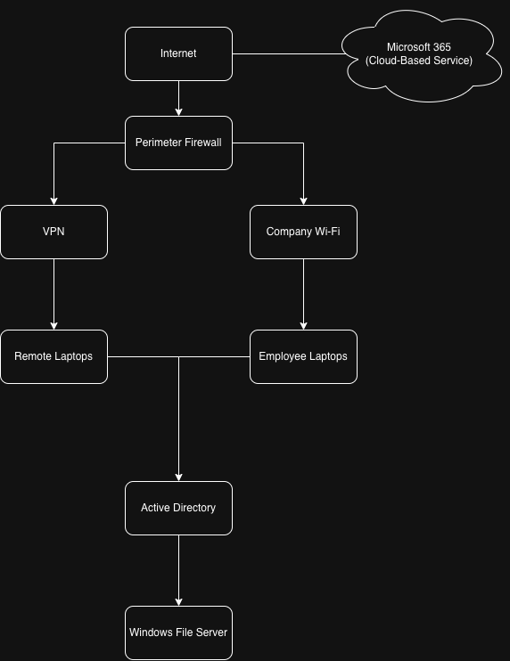

# NIST RMF Security Assessment Project

## Overview

This project is a fictional cybersecurity Governance, Risk, and Compliance assessment created to practice the NIST Risk Management Framework.

I am acting as a junior security analyst assessing the information systems of a fictional company called Sparkman Systems LLC.

## Project Objectives

The goals of this project are to:

* Define the system and its security boundary
* Categorize the system based on confidentiality, integrity, and availability
* Select relevant NIST SP 800-53 security controls
* Review fictional assessment evidence
* Identify control deficiencies and security risks
* Recommend remediation actions
* Develop a Plan of Action and Milestones
* Document identified risks in a risk register

## Controls Assessed

* AC-2 - Account Management
* AC-6 - Least Privilege
* IA-2 - Identification and Authentication
* AU-2 - Event Logging
* RA-5 - Vulnerability Monitoring and Scanning
* SI-2 - Flaw Remediation

## Assessment Summary

The assessment identified strengths in user authentication while identifying deficiencies related to account management, privileged access, logging, vulnerability management, and patch management.

Detailed assessment results, findings, risks, recommendations, and remediation actions are documented throughout the project files.

## Network Diagram

## Disclaimer

Sparkman Systems LLC and all systems, users, evidence, vulnerabilities, and findings described in this project are fictional and were created solely for educational and portfolio purposes.
